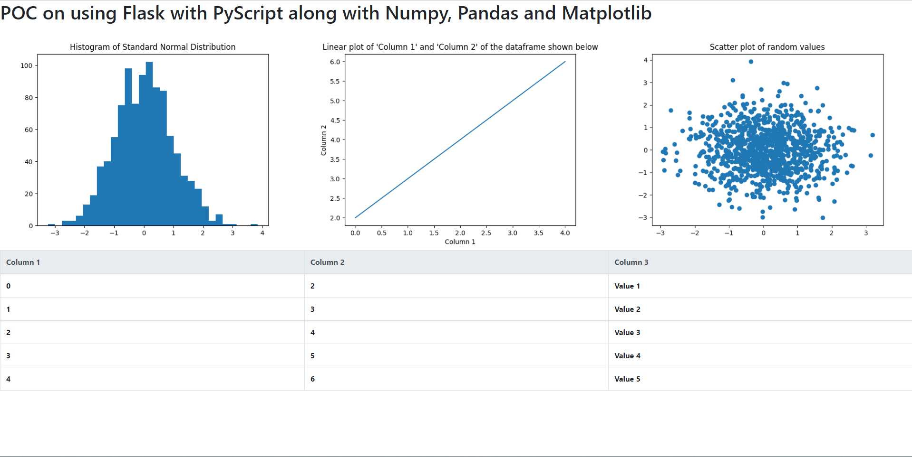

# PyScript-Flask Integration POC

The POC aims to show how to use PyScript with Flask. The Flask server sends some data to the template, PyScript reads it using Pandas and makes a Matplotlib plot on the data. Additionally, I also show how more plots can be displayed on the webpage easily through the PyScript support for Numpy and Matplotlib.



## Usage

Simply run the following command to run the Flask app 

```
python app.py
```

Then head to `localhost:5000`.  


### Huge thanks to [pyscript](https://github.com/pyscript/pyscript) for this amazing project! :clap: :clap: